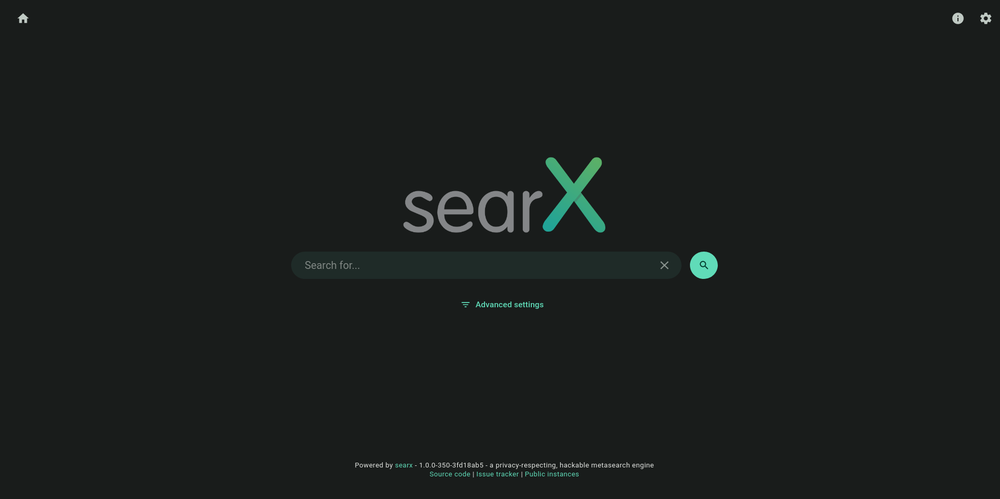
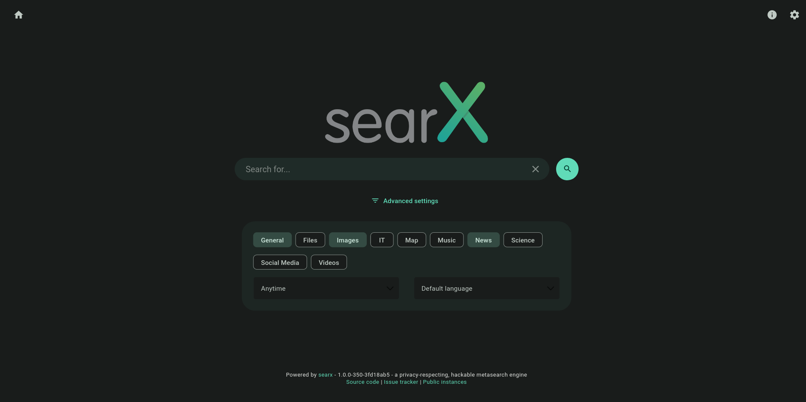
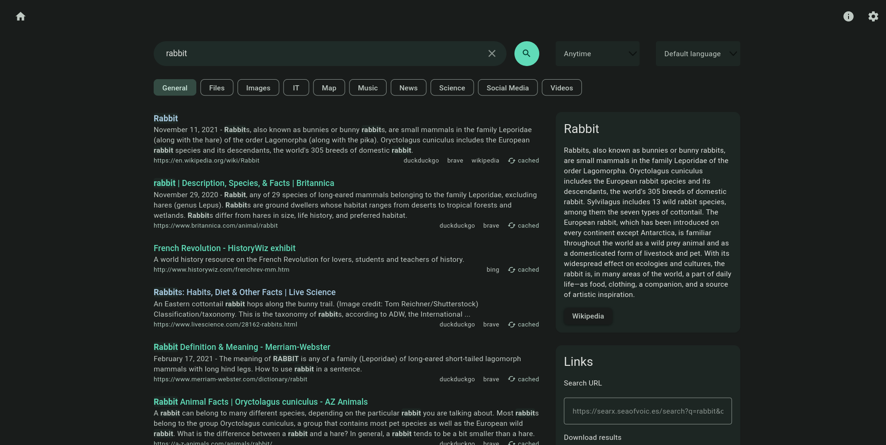
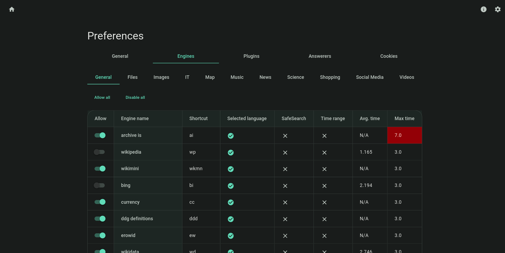
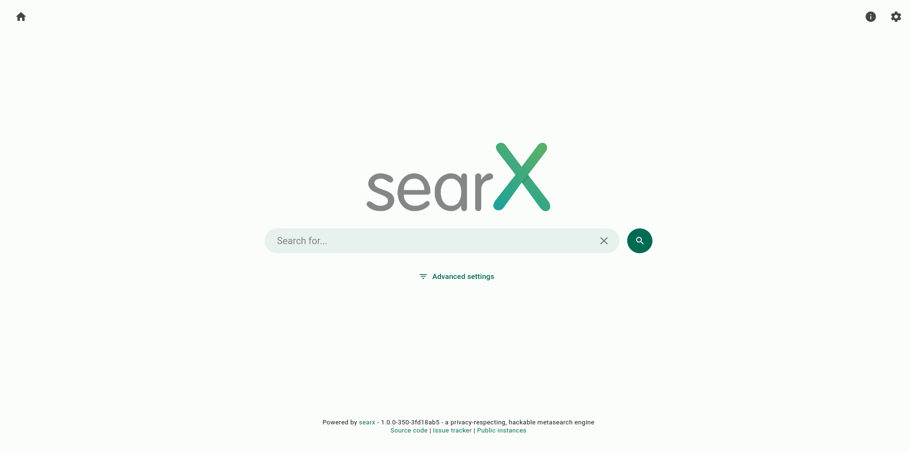
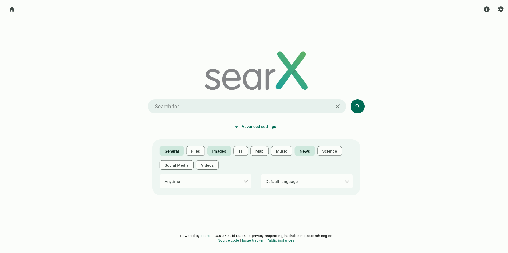
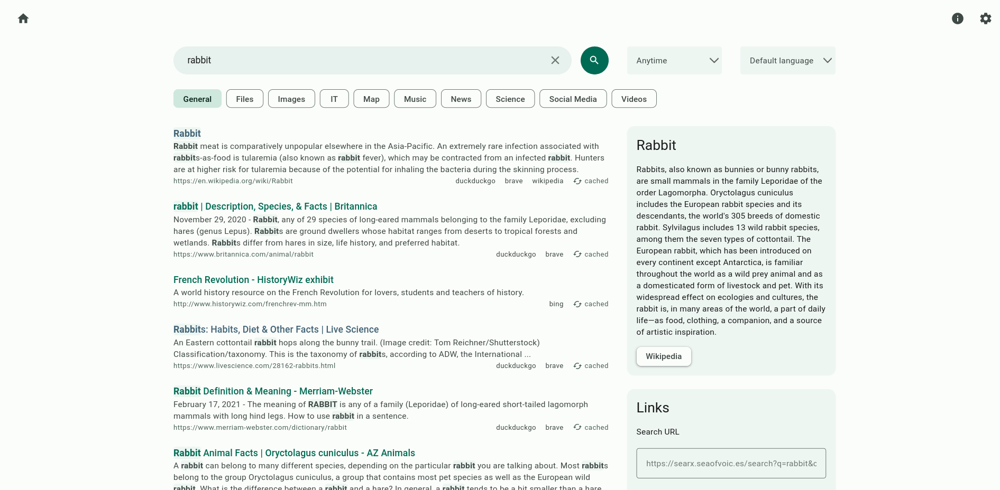
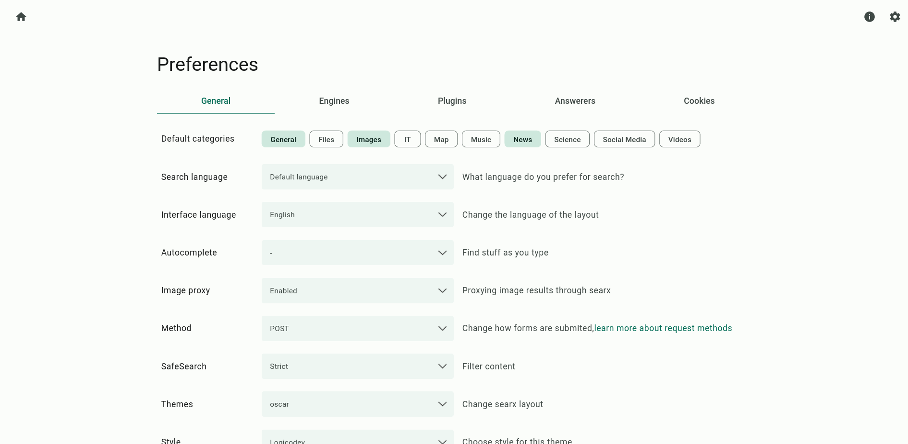

# Searx Material 3 theme

This is a theme for Searx which uses Google's Material Design 3 with a color palette generated from Searx's logo.

This theme is purely CSS which means I had to use a few "hacks" to get some things to work, and other things I would've liked are just not possible. However, being purely CSS means that you can use this theme with a CSS injector browser extension such as Stylus.

## What does it look like?

### Dark version

<table>
  <tr>
    <td></td>
    <td></td>
  </tr>
  <tr>
    <td></td>
    <td></td>
  </tr>
</table>

### Light version

<table>
  <tr>
    <td></td>
    <td></td>
  </tr>
  <tr>
    <td></td>
    <td></td>
  </tr>
</table>

## How do I use it?

1. Set the theme of your chosen Searx instance to **Oscar** and the style to **Logicodev** (*not* Logicodev dark).  
    This step is necessary because this theme assumes certain styles are already there. It may not look right with a different theme applied.  
    If you want to find an instance, go to [searx.space](https://searx.space/).
2. Install [**Stylus**](https://github.com/openstyles/stylus#stylus).
3. Click one of the **Install with Stylus** buttons above depending on which theme you want. You could install both but they might conflict with each other and look weird.
4. When the Stylus tab opens, enter the URL to your preferred Searx instance in the text box next to **Applies to URLs on the domain**.
5. **Save**, then you should be good to go!

## Thoughts

Early on in making this theme I was debating whether to make it a user style or a theme that can be installed by instance maintainers. Though more prone to breakage, I decided on making it a user style so that it would be accessible to more users. If there is enough interest I may eventually convert it to an installable theme, but for now this is the current format.
